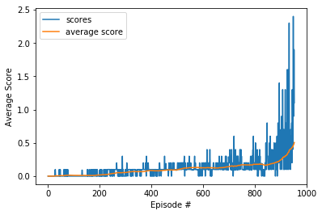

## Collaboration and Competition

### Introduction

In this project is based on the Unity "Tennis" environment, in which two agents control rackets to bounce a ball over a net.  If an agent hits the ball over the net, it receives a reward of +0.1. If an agent lets a ball hit the ground or hits the ball out of bounds, it receives a reward of -0.01. Thus, the goal of each agent is to keep the ball in play.

The observation space consists of 8 variables corresponding to the position and velocity of the ball and racket. Each agent receives its own, local observation. Two continuous actions are available, corresponding to a movement toward (or away from) the net, and jumping.

The task is episodic, and in order to solve the environment, the agents must get an average score of +0.5 (over 100 consecutive episodes, after taking the maximum over both agents). Specifically,

* After each episode, we add up the rewards that each agent received (without discounting), to get a score for each agent. This yields 2 (potentially different) scores. We then take the maximum of these 2 scores.
*This yields a single score for each episode.
The environment is considered solved when the average (over 100 episodes) of those scores is at least +0.5.

### MADDPG

In multi-agent environments the traditional RL algorithms do not perform well. Q-learning is failing in a non-stationary environment and policy gradient suffers from a variance that increases as the number of agents grow.
Multi-Agent Deep Deterministic Policy Gradient (MADDPG) is used in this project for training the agents. MADDGP is an actor-critic method where the agents share a replay buffer containing all the states and actions and the agents learn from a centralized critic. The critic is trained with all the agents' observations, but each agent's actor is trained with its own states and actions.

For a better performance, the following modifications are implemented.
* Both actor and critic models have 256 and 128 hidden nodes.
* All the observations (states and actions) are concatenated at the input layer of the critic model.
* The soft update rate (tau) is increased to 0.01
* The batch size is increased to 256
* The noise is decaying with a slow value of 0.00001, in order to increase the variety of the replay buffer.

### Simulation Results
Once these improvements are implemented, the agents are trained and the average rewards results are shown below. As it can be seen the environment is solved after 852 episodes.

### Alternate Approach

Since the Tennis environment is relatively simple and agents are symmetrical, it can be solved using two separate agents with a shared replay buffer. However, here both actor and critic use the previous experiences. The simulation results are shown below and as it can be seen the environment is solved in only 138 episodes which is significantly faster.
In this implementation, the following hyperparameters are used:

* Both actor and critic models have 256 and 128 hidden nodes.
* The soft update rate (tau) is increased to 0.15.
* The batch size is increased to 256
* The noise is decaying with a slow value of 0.0005.

### Future Improvements

The performance can be improved by using prioritized replay and further investigation on choosing the hyperparameters.